# 🌍 World Layoffs Analysis

## 📌 Overview  
I really enjoyed this coupled project. I combined a Data Cleaning Project and an EDA Project into one. I figured that since they both share the same dataset...it only makes sense. This project analyzes global layoffs using SQL. It includes **data cleaning** and **exploratory data analysis (EDA)** to uncover trends in layoffs by industry, country, and company. I found that this dataset is roughly 3 years worth of data...AND has about 2500+ records to start with.
The dataset comes from **Alex The Analyst Bootcamp Series** and has been processed using **MySQL**. I really appreciate Alex and the platform he has provided to data professionals attempting to enter the data analytics world.

**The goal of this Project was to upskill in MySQL/SQL, and to put myself in the driver seat of a Data Analyst.**

## ⚙️ Technologies Used  
- **Database:** MySQL  
- **Skills:** Data Cleaning, SQL Queries, Aggregations, Window Functions , CTE's
- **Tools:** MySQL Workbench, Git & GitHub to push to Remote Repo! Why not?

## 🚀 Project Workflow  
This project is divided into two main parts:  
1. **Data Cleaning** 🧹  
   - Remove duplicated data
   - Standardizing the data (whitespaces, inconsistent data, date format)
   - Removing Null/Blank values and populating with date if possible
   - Remove columns/Row that are not necessary

2. **Exploratory Data Analysis (EDA) 📊**  
   - Layoffs trend analysis (by year and month)  
   - Industries most affected  
   - Layoffs by country  
   - Largest layoffs events  
   - And more exploratoryiness... 

## 📊 Key Insights  
✅ **Tech Industry Hit Hardest:** The technology industry saw the highest layoffs.  
✅ **U.S. Had the Most Layoffs:** Companies in the U.S. accounted for the majority of layoffs.  
✅ **2023 Peak Layoffs:** Layoffs spiked in early 2023 due to economic downturns.  

## 🔍 Lessons Learned
- Handling messy real-world data using SQL
- Geting more comfortable with ....WINDOW FUNCTIONS...
- Writing efficient SQL queries for large datasets
- Staging tables to not affect the raw data
- Extracting insights from data using aggregation functions, CTE's

## Screenshots With Queries I Worked With

**Please check out sql folder & screenshots folder with queries if interested in seeing the culmination of <u>ALL</u> queries...only included a limited amount of key insights/queries below**

<h1>Data Cleaning Screenshots 🧹
 </h1>

<h2>What am I working with?</h2>
    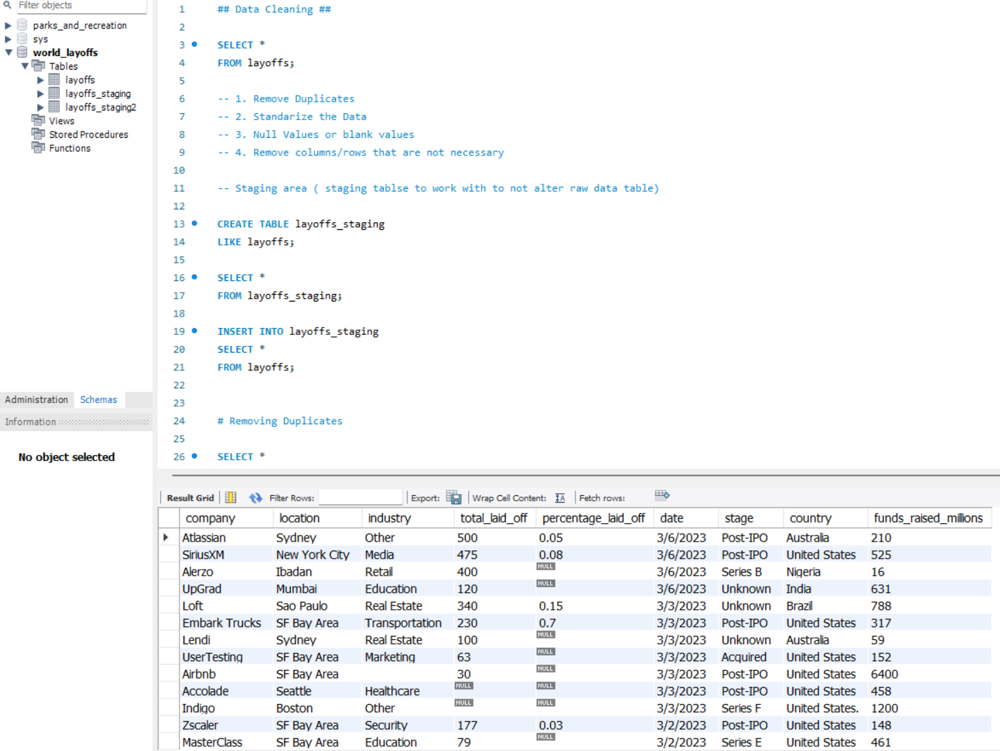
    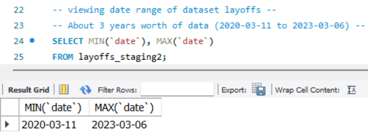
     

 💥 <strong>Here is a glimpse of the data I am working with. You can see here I will also be creating staging tables to not alter the raw data. That way, I can work with the staging data however I see fit. Second image, this is the date range.</strong>

<h2>Saying Goodbye to Duplicates</h2>
    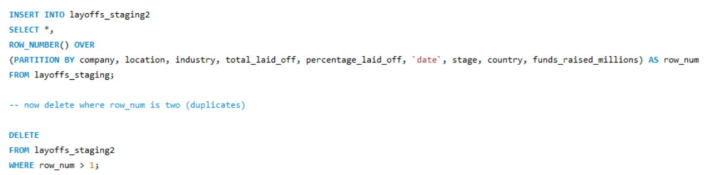
     

 💥 <strong>Here I have a staging table of the original dataset. I used a Window Function (ROW_NUMBER()) to partition over everything. Why? The idea is to make sure there aren't any "2's" in the newly created rank_num column. If there was, that means there are duplicates. It's basically saying..."hey you already have this and this is the 2nd entry!". </strong>

<h2>Watching Out For Inconsistency</h2>
    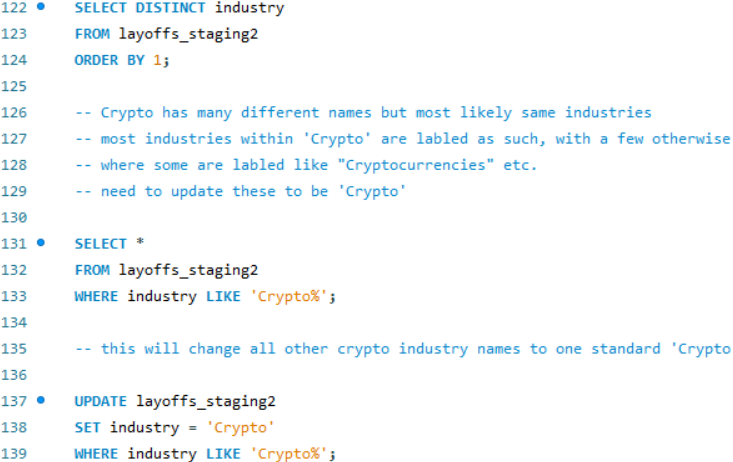
     

 💥 <strong>Found some inconsistencies across some of the fields of data. This specific query found that the Crypto industry had different names(Crypto, cryptocurrencies etc). This was found out by using DISTINCT. It was also updated to just "Crypto"...standardization!</strong>

  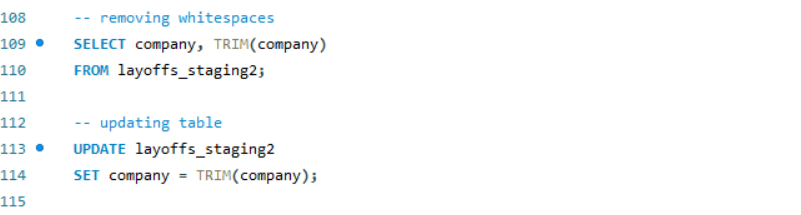
     

 💥 <strong>Whitespace Removal</strong>

 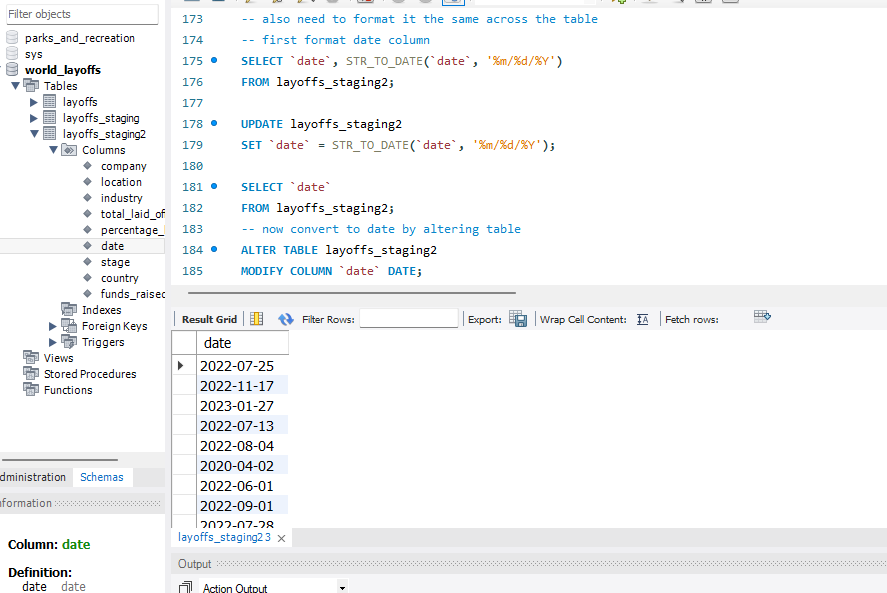
     

 💥 <strong>Formatting date across the table, and coverting from text to date data type</strong>

<h2>Nulls & Blank Values</h2>
    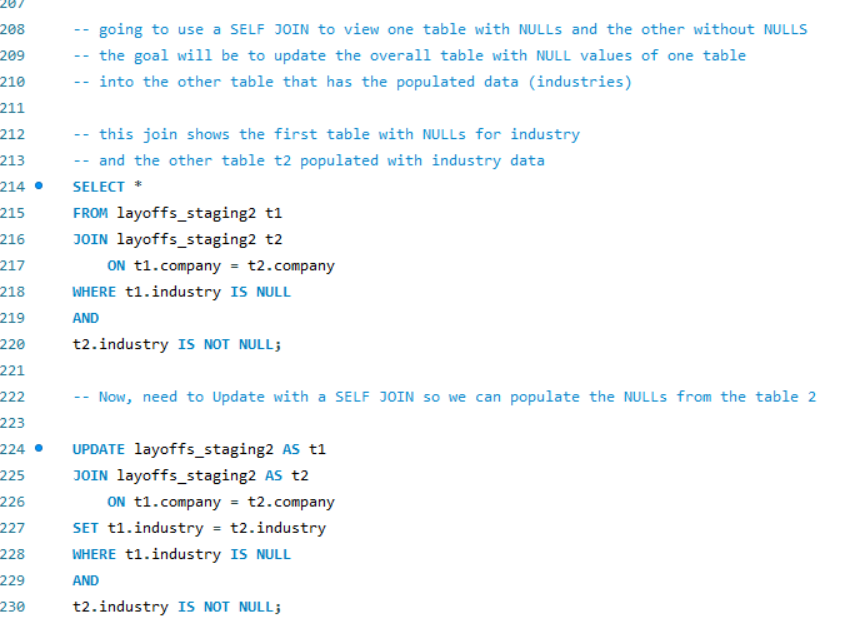
     

 💥 <strong>Before this query, I made all industry columns that had a blank ('') entry and just turned them into NULLs. That way I am just now working with <u>just</u> Nulls. I also performed a SELF JOIN. The goal was to find matches on the company within the same table. One table had nulls and the other was filled with correct industries. The extended goal was to populate(UPDATE) this table(t1) with the correct industry data from t2.  </strong>

<h1>EDA Screenshots 📊 </h1>

<h2>Yearly/Monthly Layoff Trends</h2>
    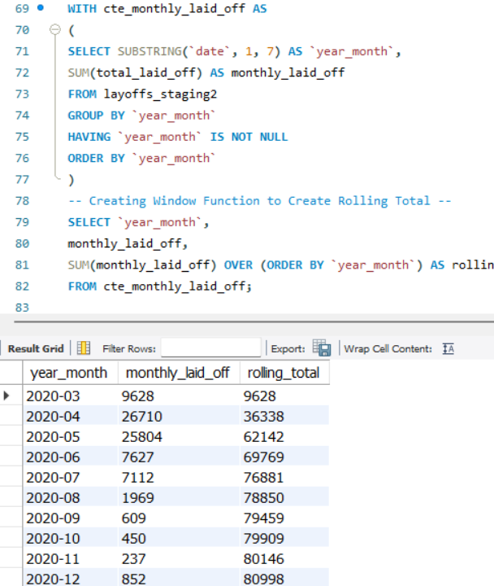
     

 💥 <strong>Here, a CTE was created and a Window Function on top of the CTE to create a rolling total. This one was pretty complex, and had me second guessing everything. Although, I am glad I had the walkthrough from Alex via the bootcamp. I can definitely see how beneficial it is to create a Rolling Total. It breaks down month-by-month layoffs for a better visual.</strong>

<h2>Countries & Companies Most Affected</h2>
    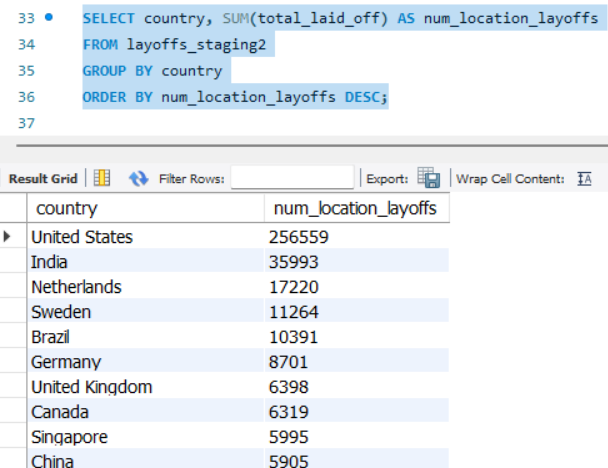
     

 💥 <strong>This query showed a break down of countries most affected by layoffs. USA taking the lead in most layoffs.</strong>

    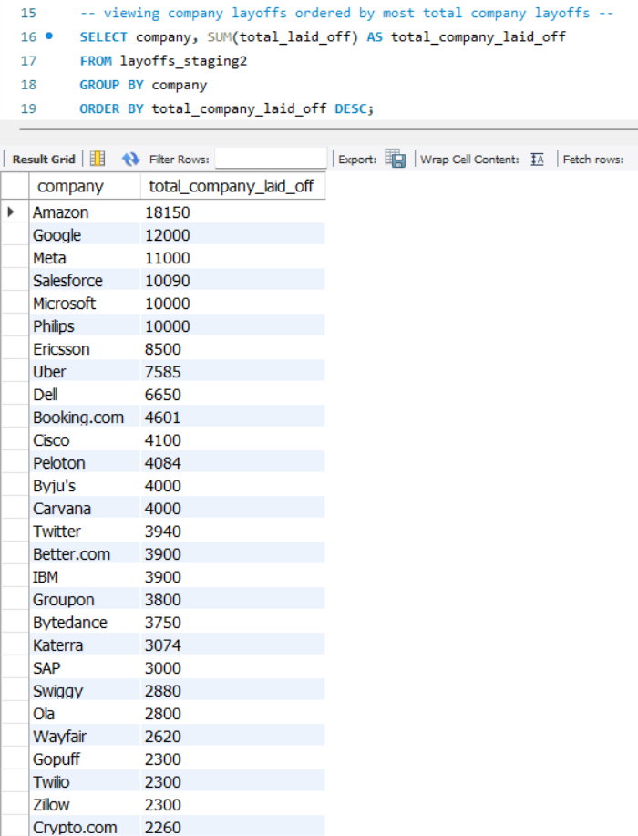
     

 💥 <strong>Companies ranking from highest to lowest total layoffs in dataset.</strong>

<h2>Largest Layoff Events</h2>
    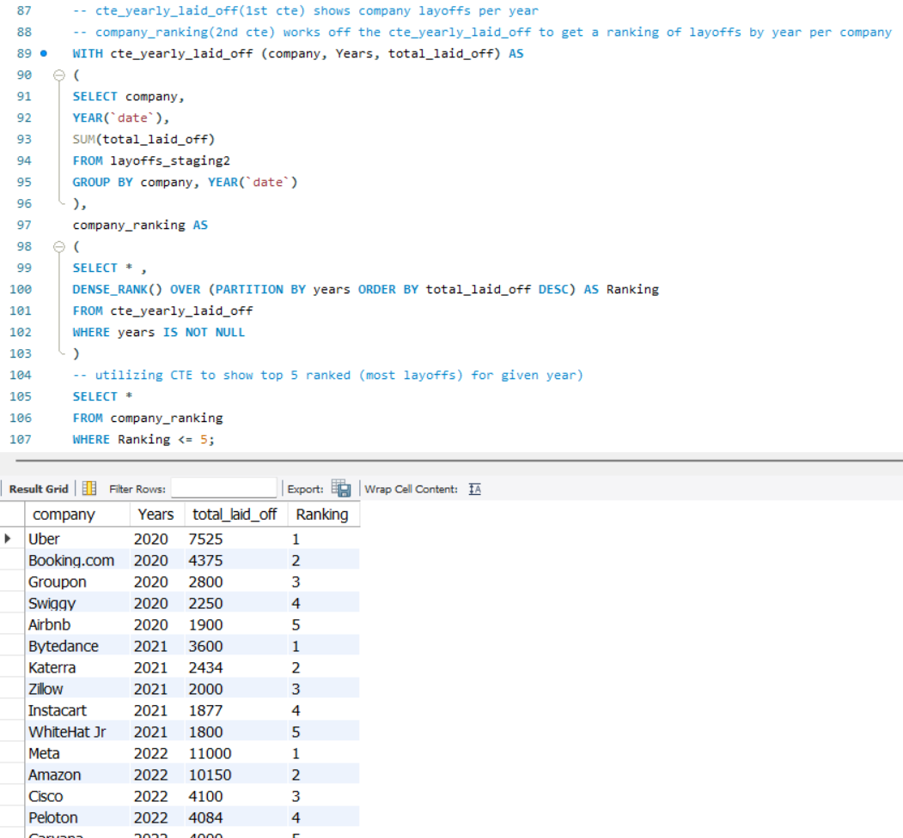
     

 💥 <strong>Here, a double CTE + Window Function was used to ultimately rank Companies with the most layoffs by Year. This was just the top 5 most layoffs within given year.</strong>

    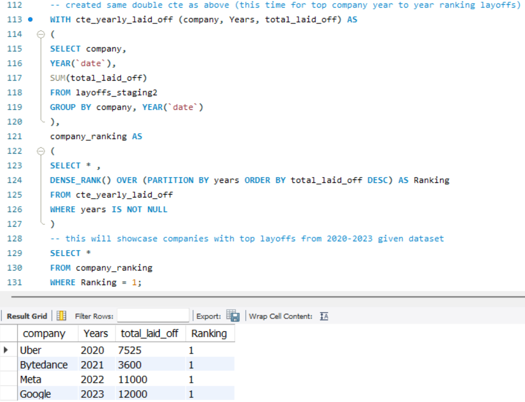
     

 💥 <strong>NOW, this is the query I will end with. This pinpointed Top Companies that laidoff the most Employees per year from 2020-2023. This is the same exact query as above, except for a slight change to the ending SELECT statement...by changed ranking to be only showcase companies with the most layoffs in given year.</strong>

 

Thanks for stopping by and getting this far.

Connect With Me Below.

